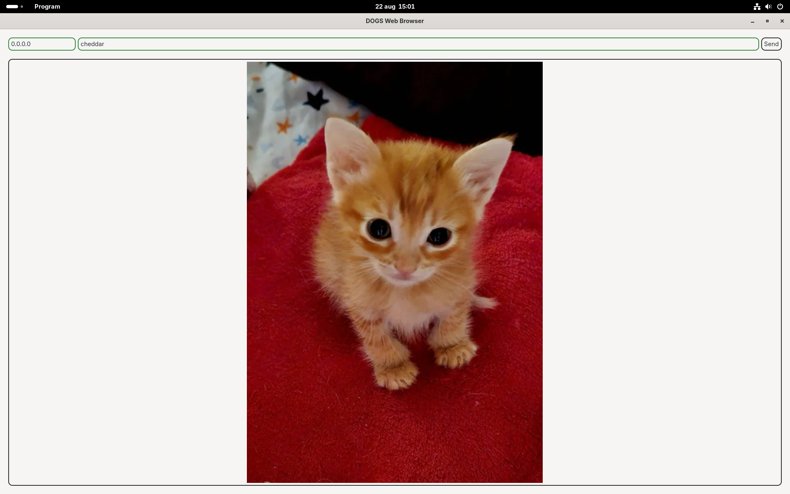

# dogs-web
A internet browser with UI using the DOGS networking protocol. Made with GTK4 in Rust.




## Note:
In order to compile this you might need certain dependencies.
That problem can be solved with this command on Fedora Linux 42:
```sh
sudo dnf install gtk4-devel
```
